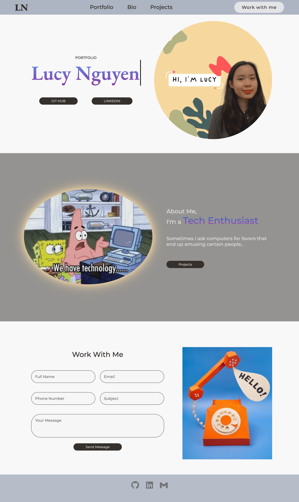
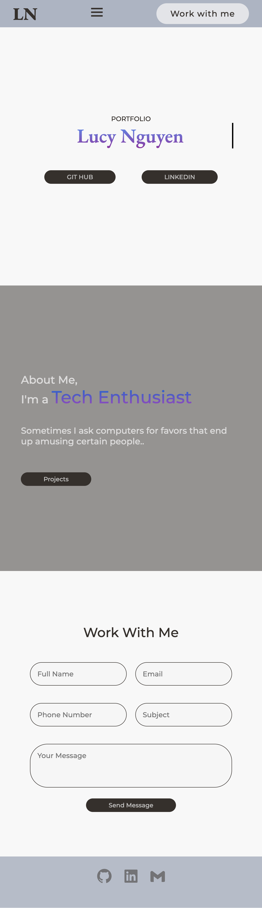

# Lucy Nguyen - Portfolio Task
​
[My portfolio site](https://duong-28.github.io/)
​
## Project Requirements

### Content
Welcome to my portfolio website! Here's a brief overview of its main features:

- [] Profile Picture: Edited with Canva to provide a personal touch to my homepage. 
- [] Biography: My bio is staying brief and concise, I have plans to expand it as I gain more experience.
- [] Contact Form: Made a contact form available for anyone who would like to reach out. 
- [] External links to my GitHub, LinkedIn, and email are included for users convenience and further contact.
- [] Although there are no project sections at the moment (haven't a project to showcase!), I included a button to be linked to it (hopefully in the near future) in the Bio Section just to show that it's still under development. 
​
### Technical
The project is version-controlled with Git and deployed on GitHub Pages. It's designed to be responsive to have different features on the smaller screen.

-[] Website description: 

The website starts with a fixed header to make navigation easy. I added a smooth scrolling effect for a better user experience when clicking on the navigation items in the header. The 'Work With Me' button is positioned separately to make it stand out more. All items in the header glow and expand when hovered over.

On the first page, my profile photo bounces in (that's why it's round!), and it's next to my name, which has a typewriter effect. The gradient purple color is a nod to the SheCodes theme. The buttons for my GitHub and LinkedIn profiles are external links that also change color when hovered over.

The second page is my bio. It includes a photo and a text section on the opposite side and in a different color from the first page to enhance the viewing effect. The GIF is illuminated as a way of saying, "technology lights up my life!"

The last page is the Contact Form. I'll admit it needs more work as it's currently quite simple, but it is functional.

Similar to the header, items in the footer also expand and glow when hovered over. They are icons for GitHub, LinkedIn, and email, downloaded from Boxicons, and are linked to my personal GitHub, LinkedIn, and email.

The background colors on all pages are chosen to be easy on the eyes, regardless of the time of day, to enhance user experience. I also worked a bit on the scrollbar to give it a more minimal and elegant look.
​
### Screenshots
> Please include the following:
> - The different pages and features of your website on mobile, tablet and desktop screen sizes (multiple screenshots per page and screen size).
> - The different features of your site, e.g. if you have hover states, take a screenshot that shows that.  
> 
> You can do this by saving the images in a folder in your repo, and including them in your readme document with the following Markdown code: 

####  Lucy Portfolio - Website Screenshot

####  Lucy Portfolio - Website Screenshot_Smaller Screen Responsive Design
